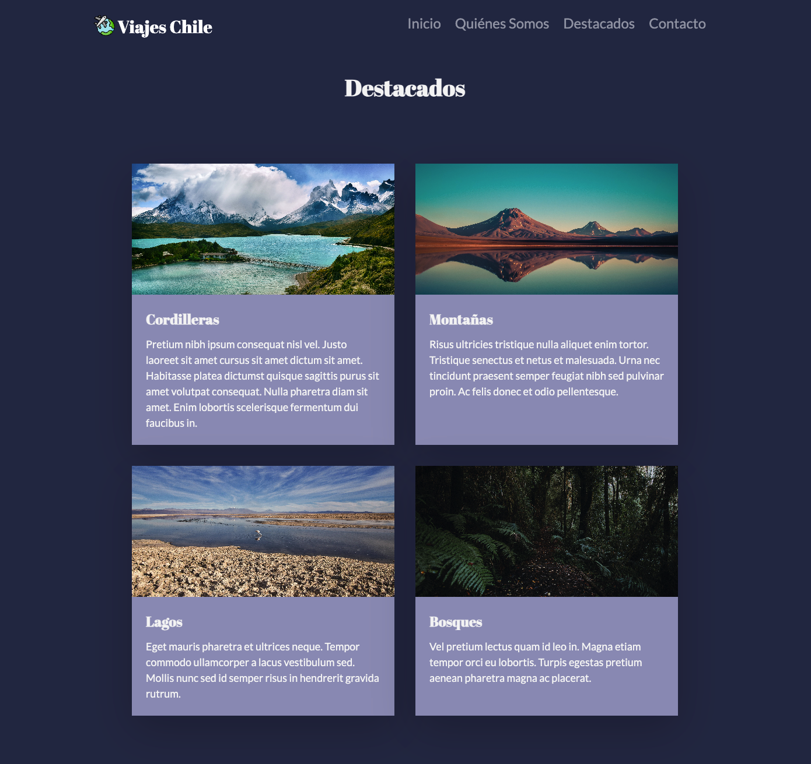
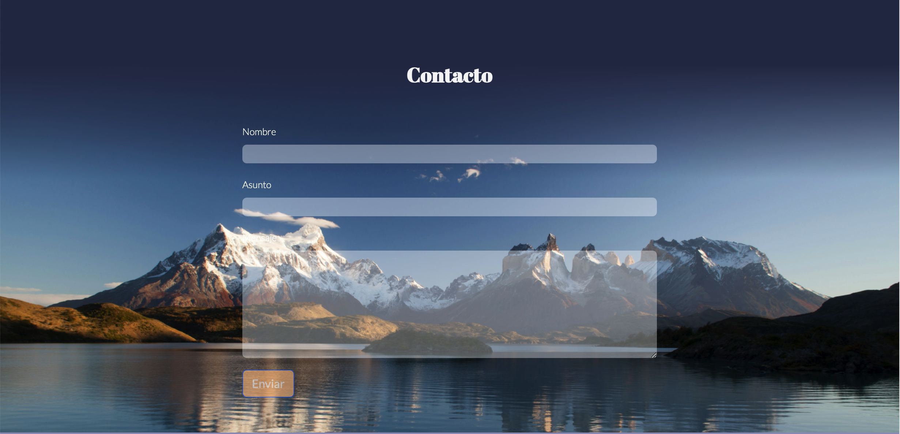
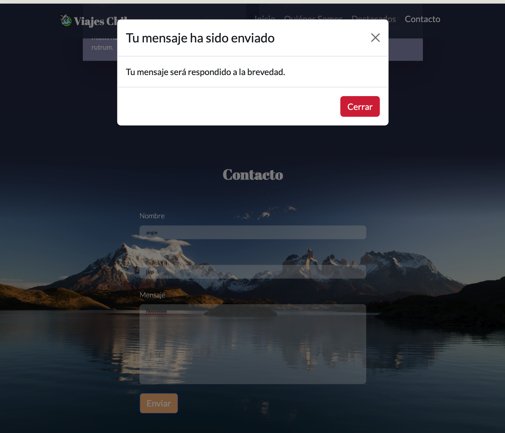
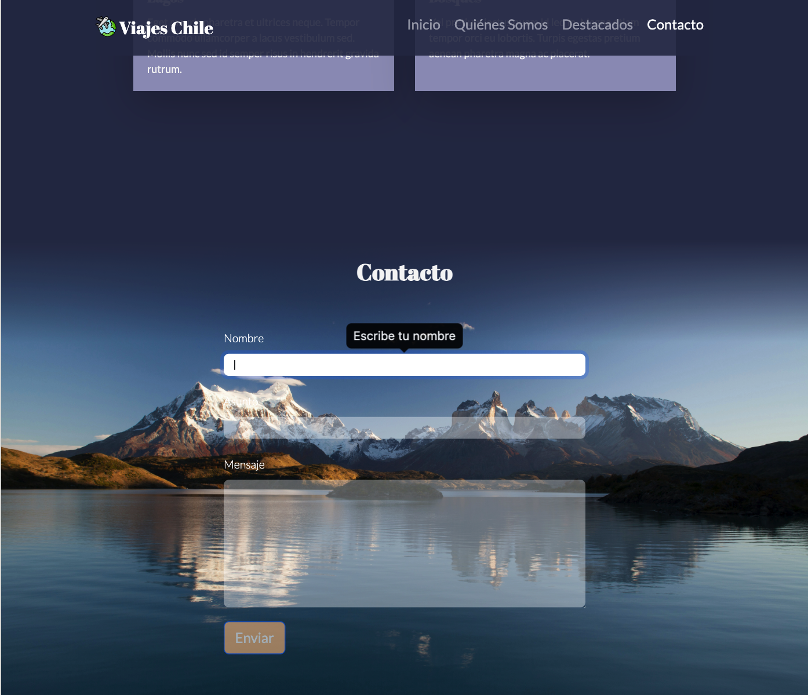
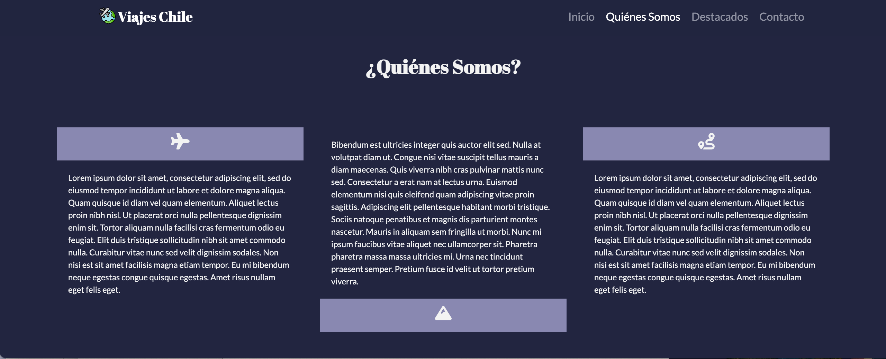
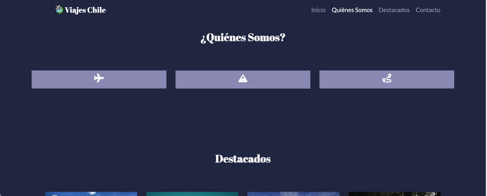
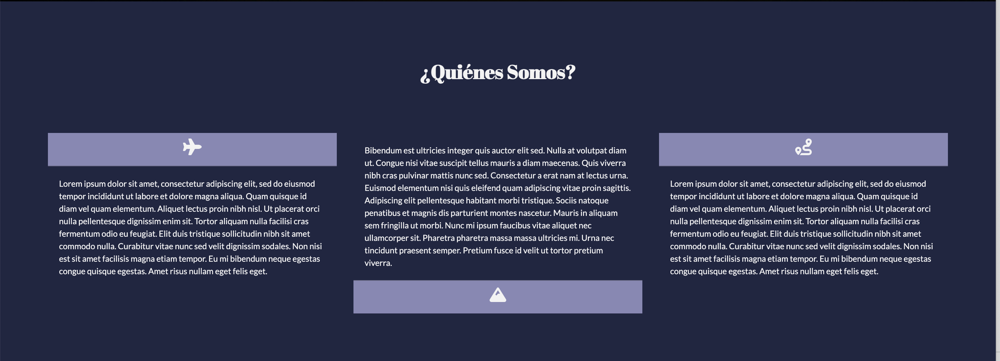
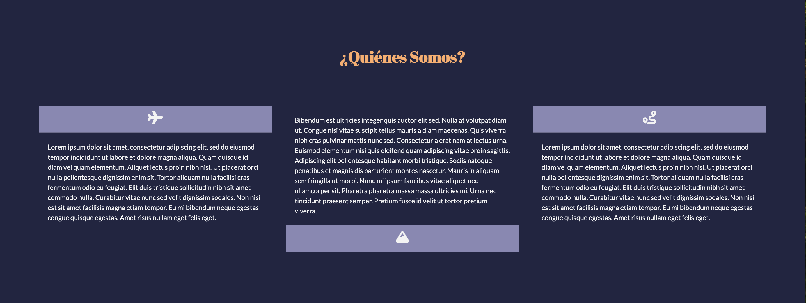

# Hola Mundo
## Este fue un trabajo de Angela González
#### Fueron utilizadas las fuentes Lato y April Fatface
Además, se utilizó una imagen de fondo de [Kurt Cotoaga](https://unsplash.com/es/@kydroon). Del repositorio de imágenes gratuitas [UNSPLASH](https://unsplash.com/es)

### Elementos Bootstrap utilizados
#### Navbar 

### Grid Cards

### Form

### Footer

### Elementos Bootstrap JS utilizados
#### Carousel 

### Modal

### Tooltips

### Cerrar tarjeta clickeando el título 

### Título cambia de color con hover 

